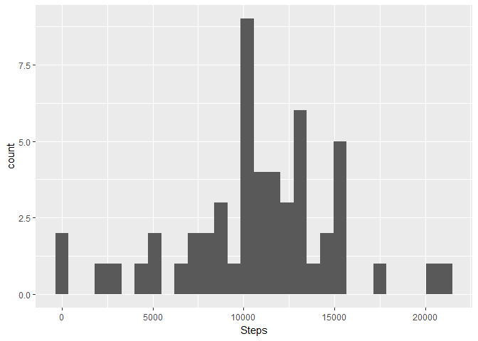
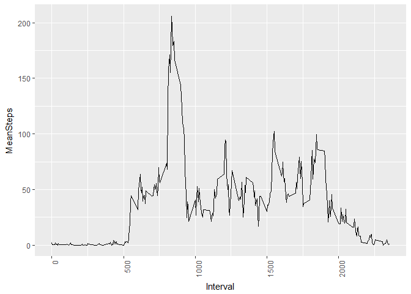
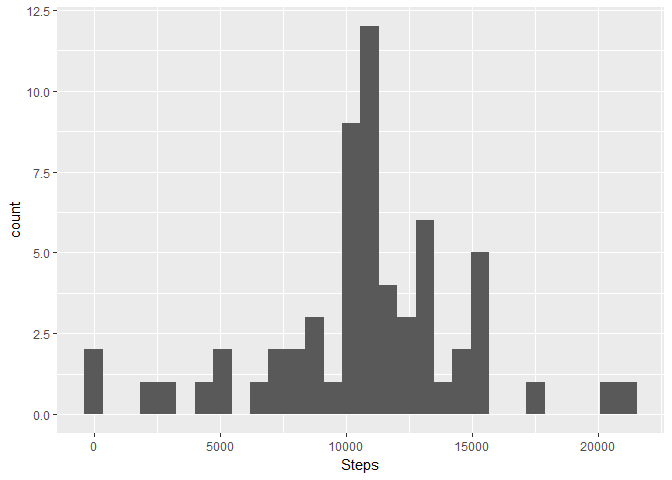
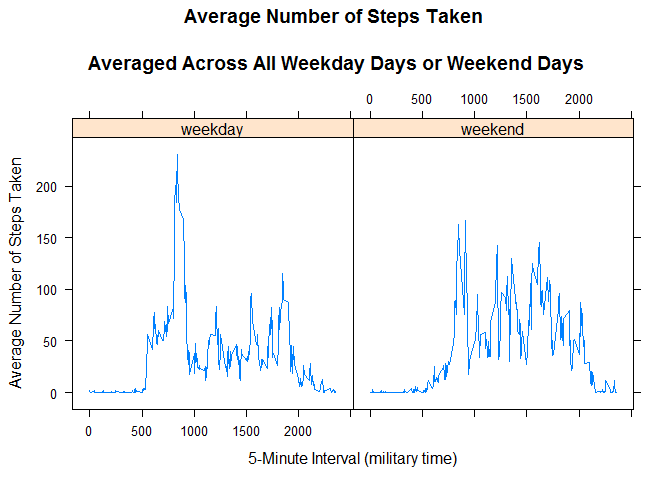

# PA1_template
Sanjeev Burge  
October 15, 2017  


# R Markdown
This R Markdown document is for assignment of Reproducible research week2 that has following objectives
1. Code for reading in the dataset and/or processing the data
2. Histogram of the total number of steps taken each day
3. Mean and median number of steps taken each day
4. Time series plot of the average number of steps taken
5. The 5-minute interval that, on average, contains the maximum number of steps
6. Code to describe and show a strategy for imputing missing data
7. Histogram of the total number of steps taken each day after missing values are imputed
8. Panel plot comparing the average number of steps taken per 5-minute interval across weekdays and weekends
9. All of the R code needed to reproduce the results (numbers, plots, etc.) in the report

First download the zip file and unzip the file in the working directory and
read the file into the dataframe

#Loading and preprocessing the data

```r
#Change the current working directory to the project directory 
  setwd("D://R/Reproducible Results")
  
#Download the zip file and unzip it
  download.file("https://d396qusza40orc.cloudfront.net/repdata%2Fdata%2Factivity.zip","activity.zip")
  unzip("activity.zip")
  activityDF <- read.csv("activity.csv")

   #Ignore the blank/NA records
  activityDF <- activityDF[complete.cases(activityDF),]
```
# What is mean total number of steps taken per day?
Histogram of number of steps taken each day

```r
library(ggplot2)
library(dplyr)
```

```
## 
## Attaching package: 'dplyr'
```

```
## The following objects are masked from 'package:stats':
## 
##     filter, lag
```

```
## The following objects are masked from 'package:base':
## 
##     intersect, setdiff, setequal, union
```

```r
activityDF$date <- as.Date(activityDF$date)
sumByDate <- aggregate(activityDF$steps,by=list(Date=activityDF$date),sum)
#Give proper names
  names(sumByDate) <- c("Date","Steps")

ggplot(data=sumByDate,aes(Steps),)+geom_histogram()
```

```
## `stat_bin()` using `bins = 30`. Pick better value with `binwidth`.
```

<!-- -->

```r
#ggplot(data=sumByDate,aes(Date,Steps))+stat_summary(fun.y=sum,geom="bar",width=0.5)+scale_x_date(breaks = c(sumByDate$Date)) + theme(axis.text.x = element_text(angle = 90, hjust = 1, vjust=1))
```

Mean and median number of steps taken each day


```r
s <- summary(sumByDate)
s[[3,2]]
```

```
## [1] "Median :10765  "
```

```r
s[[4,2]]
```

```
## [1] "Mean   :10766  "
```
#What is the average daily activity pattern?
Time series plot of the average number of steps taken

```r
avgByInterval <- aggregate(activityDF$steps,by=list(dates=activityDF$interval),mean)
#Give proper names
  names(avgByInterval) <- c("Interval","MeanSteps")

  ggplot()+geom_line(data=avgByInterval,aes(Interval,MeanSteps), group=1)+theme(axis.text.x = element_text(angle = 90, hjust = 1, vjust=1))
```

<!-- -->


Which 5-minute interval, on average across all the days in the dataset, contains the maximum number of steps?

```r
avgByInterval[which.max(avgByInterval$MeanSteps),]
```

```
##     Interval MeanSteps
## 104      835  206.1698
```

# Imputing missing values
Code to describe and show a strategy for imputing missing data

```r
activityNADF <- read.csv("activity.csv")

missingDF <- activityNADF[is.na(activityNADF$steps),]
#total rows with NA steps
nrow(missingDF)
```

```
## [1] 2304
```

```r
imputedDF <- inner_join(activityNADF, avgByInterval,by=c("interval" ="Interval"))
imputedDF$steps[is.na(imputedDF$steps)] <- imputedDF$MeanSteps[is.na(imputedDF$steps)]
```
#Histogram of the total number of steps taken each day after missing values are imputed

```r
imputedSumByDate <- aggregate(imputedDF$steps,by=list(dates=imputedDF$date),sum)
#Give proper names
names(imputedSumByDate) <- c("Date","Steps")
imputedSumByDate$Date <- as.Date(imputedSumByDate$Date)
ggplot(data=imputedSumByDate,aes(Steps),)+geom_histogram()
```

```
## `stat_bin()` using `bins = 30`. Pick better value with `binwidth`.
```

<!-- -->

```r
#ggplot(data=imputedSumByDate,aes(Date,Steps))+stat_summary(fun.y=sum,geom="bar",width=0.5)+scale_x_date(breaks = c(imputedSumByDate$Date)) + theme(axis.text.x = element_text(angle = 90, hjust = 1, vjust=1))

ims <- summary(imputedSumByDate)
ims[[3,2]]
```

```
## [1] "Median :10766  "
```

```r
ims[[4,2]]
```

```
## [1] "Mean   :10766  "
```

# Are there differences in activity patterns between weekdays and weekends?
Panel plot comparing the average number of steps taken per 5-minute interval across weekdays and weekends

```r
library("lattice")

imputedDF$date <- as.Date(imputedDF$date)
imputedDF$weektime <- as.factor(ifelse(weekdays(imputedDF$date) %in% 
                c("Saturday","Sunday"),"weekend", "weekday"))

imputedAvgByInterval <- aggregate(imputedDF$steps,by=list(Interval=imputedDF$interval,weektime=imputedDF$weektime),mean)
#Give proper names
names(imputedAvgByInterval) <- c("Interval","weektime","MeanSteps")

p <- xyplot(MeanSteps ~ Interval | factor(weektime), data=imputedAvgByInterval, 
       type = 'l',
       main="Average Number of Steps Taken 
       \nAveraged Across All Weekday Days or Weekend Days",
       xlab="5-Minute Interval (military time)",
       ylab="Average Number of Steps Taken")
print (p) 
```

<!-- -->

The plot suggests that the person moves around more during the weekend days.  
